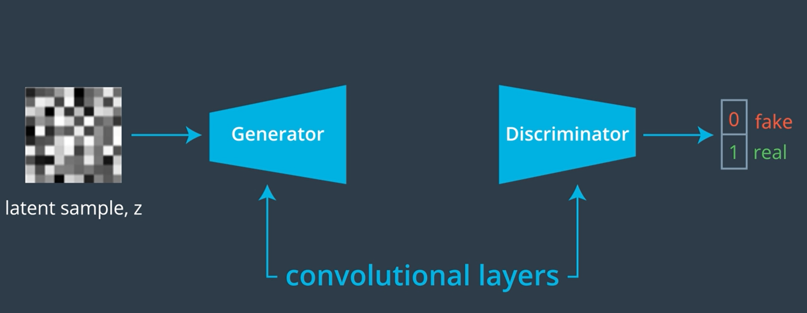

# Street View House Numbers and Celebrity Faces Generation using DC-GAN 


### Generate fake images of Street View House Numbers and Celebrity Faces using Deep Convolutional Generative Adversarial Network (DC-GAN)


## Table of Contents

- [Introduction](#introduction) 
- [Objective](#objective)
- [House Number Image Generation](#svhn-image-generation)
- [Celebrity Face Image Generation](#celebrity-face-image-generation)
- [License](#license)
- [Author Info](#author-info)

---
## Introduction
In this project we try to generate _fake_ house numbers based on Street View House Number (SVHN) dataset and _fake_ human faces using Large-scale CelebFaces Attributes (CelebA) Dataset. Both CelebA and SVHN dataset is more complex than MNIST dataset hence for this problem we are going to use a variation of Generative Adversarial Network (GAN) called Deep Generative Adversarial Network or DC-GAN. DC-GAN is an extension and builds on the same idea of GAN networks. Refer [MNIST Digit Generation Using GAN](https://github.com/sssingh/mnist-digit-generation-gan) repo for a detailed discussion along with a full fledged working application of GAN network. Just like GANs, `DC-GANs` are also composed of two competing networks, the `Discriminator` that classifies images as _real_ or _fake_ and the `Generator` that learns from real dataset (MNIST, SVHN, CelebA etc) and generates the _fake_ images. However, in case of DC-GAN, instead of simple `fully-connected` _Linear_ layers, `Convolution` and `Transpose Convolution` layers are used for network composition. By doing this we give DC-GAN networks the capability of learning from `spatial` image data instead of just flattened image vector. Hence, DC-GAN can work with complex image datasets and produce better results than simple GANs. 

Have a look at the [DC-GAN Original Paper](https://arxiv.org/pdf/1511.06434.pdf) for more details.

As shown in below diagram the Generator consumes the `latent noise sample` and up-samples it to produce _fake_ images of same size as that of images coming from real dataset. The Discriminator down-samples the image to produce a single `logit` that'd be eventually used to classify image as _fake_ or _real_




Just like a simple GAN, both `Generator` and `Discriminator` in DC-GAN  train in parallel. Discriminator gets to see images from real dataset as well as the _fake_ images generated by the Generator and its job is to correctly classify _real_ images vs _fake_ images. At the same time, based on how Discriminator is performing in real vs fake classification, Generator keeps improving its generated images to make them look like the images taken from real dataset. Basically Generator tries to fool the Discriminator and Discriminator tries to not get fooled.

---
## Objective
Our goal in this project is to... <br>
    1. Build a DC-GAN network and train it over ***SVHN*** dataset so that the network learns to generate _fake_ `street-house-numbers` images that would look like to have come from the real SVHN dataset.<br>
    2. Build a DC-GAN network and train it over ***CelebA*** dataset so that the network learns to generate _fake_ `celebrity-faces` images that would look like to have come from the real CelebA dataset.

---
### SVHN Image Generation

#### Dataset
- SVHN dataset consists on 73,257  training images and 26,032 testing images. For this task we'll just use the training dataset.
- Every image in the dataset belongs to one of the 10 classes (digit 0 to 9), however for this task the image labels do not matter and we won't use them.
- Each image in the dataset is 32x32 RGB image, Few samples of SVHN images are shown below...


- We will use the in-built SVHN dataset from PyTorch's `torchvision`package. Alternatively, the raw dataset can be downloaded from the original source [The Street View House Numbers (SVHN) Dataset](http://ufldl.stanford.edu/housenumbers/). The raw dataset provides train and test sets in `.mat` file format.


#### Solution Approach
##### Data Load
- Just the `training` dataset is downloaded using `torchvision` SVHN dataset in `svhn_data` folder
- The training dataset is then wrapped in dataloader object with a `batch_size` of 128. Note that even though dataloader will give us the images are their associated labels we'll simply ignore the labels.

##### Network Definition
A high-level DC-GAN network schematic is shown below...


- The `Discriminator` network is simply a binary-classifier for classifying the input image as _real_ (1) or _fake_ (0).
- Network is composed to consume batch of images (real or fake) and pass them through a series of 3 `Convolution` (Conv2D) layers and 1 `fully-connected` layer
- `LeakyReLU` is used as the activation function with `negative-slope` of 0.2 as per original paper recommendation.
- The last layer of the network is a `fully-connected` `Linear` layer producing a single `logit` which will then be passed through a `sigmoid` function to generate prediction probability.
- `Batch Normalization` (BatchNorm2D) is applied after each of the convolution layers, though the original paper recommends to use it only after 2nd and 3rd layers but during training I found that using it after every layer makes it perform better. 
- The down-sampling of images size is performed by using a `stride of 2` instead of using `MaxPooling`, this is again one of the recommendation from the paper.


Note that there is an error in diagram where shows BatchNorm2D being applied only after 2nd and 3rd layer. The configured Discriminator Layers are shown below...


- `Generator` is the most interesting and the heart of a GAN. It learns to generate _synthetic_ (_fake_) data based on the underlying pattern/structure of the training data.
    - Network is defined to consume a `latent sample noise` (z of length 100) and up-samples it first by passing it through a `fully-connected` Linear layer and then through a series of 3 `Transpose Convolution` (ConvTranspose2D) layers. ConvTranspose2D layers work like Conv2D layers but in reverse i.e. instead of going from `wide and shallow` input to `narrow and deep` output i.e from an image to long/deep feature vector, it does totally opposite of it i.e. goes from long/deep feature vector to an image.
    - A `ReLU` activation is used as per the original paper recommendation.
    - Last ConvTranspose2D layer output is then passed through `tanh` function to produce final output of Generator between -1 and 1. 
    - `Batch Normalization` (BatchNorm2D) is applied after each of the convolution layers

<br><br>

Note that there is an error in diagram where shows BatchNorm2D being applied only after 2nd and 3rd layer. The configured Discriminator Layers are shown below...

<br><br>


##### Loss Definition
DC-GAN loss computation is exactly same as that of GAN networks. 

Note that GAN network training is bit different compare to our typical supervised neural-network training. In case of GAN there are two separate networks being training together and these network has different and opposing objectives (i.e. they are competing). The `Discriminator` trying to identify if the image sample is _real_ and from actual MNIST dataset or its  _fake_ images generated by our `Generator`. Note that here we are NOT interested in correctly classifying the digits themselves. We;d need to define two separate loss functions.
1. real_loss: calculates loss when images are drawn from actual dataset. The predicted output is compared against the target label `1` which indicates real images.
2. fake_loss: calculates loss where images are generated by the Generator. The predicted output is compared against the target label `0` which indicates fake images. 

`Discriminator` computes both of the above losses and adds them together to get a `total-loss` for back-propagation
`Generator` computes the `real_loss` to check how successful it has been in _fooling_ the `Discriminator` i.e. even though it generates fake images (target 0), by computing real_loss its actually comparing discriminators output with `1` in other word generator loss has labels `flipped`


##### Network Training
DC-GANs are trained is exactly same manner as as that of GAN networks. 

- We are training two separate networks we need two separate optimizers, one for each network. In both cases we are using `Adam` optimizer with a `learning-rate` of `0.0002`, `beta1` as default `0.5` and `beta2` as `0.999` as per the original paper recommendations.
- Since classification is between two classes (real and fake) and our Discriminator outputs a `logit` we are using `BCEWithLogitsLoss` as the loss function. This function internally first applies a `sigmoid` activation to logits and then calculates the loss using `BCELoss` (log loss) function.
- Before start of training we create a (16 x 100) `fixed-random-noise-vector` drawn from a `normal distribution` between range `-1 and 1`. This vector is kept fixed through out the training. After each epoch of training we feed the noise vector to, so far, trained Generator to generate _fake_ images, these images help us visualize how and if generated image quality is improving or not. A sample of noise vector is is shown below..

<br><br>

- `Discriminator` is trained as follows...
    - A batch of `real` SVHN images are drawn from the dataloader
    - Each image in the batch ia then `scaled` to values between `-1 and 1`. This is a very important step and required because Discriminator not just looks at _real_ images from SVHN dataset but also looks at _fake_ images from Generator whose output is in range `-1 to 1` (last layer output of Generator network is `tanh` activated). We need to ensure that in both cases the range of input values is consistent.
    - data batch is then fed to Discriminator, its predicted output is captured and `real_loss` is calculated
    - A batch noise data (`z`) drawn from a `normal distribution` between range `-1 and 1` is created
    - Noise `z` is then fed through the Generator, its outputs (fake images) are captured and `fake_loss` is calculated
    - Then discriminator's `total_loss` is computed as `real_loss + fake_loss`
    - Finally `total_loss` is back-propagated using discriminator's optimizer
- After one batch of `Discriminator` training (above), the `Generator` is trained as follows...
    - A batch of noise data (`z`) drawn from a `normal distribution` between range `-1 and 1` is created
    - Noise `z` is then fed through the Generator, its outputs (fake images) are captured
    - The generated _fake_ images are then fed through the `Discriminator` and its predicted output is captured and `real_loss` is calculated
    - Note that for _fake_ generated images we are calculating `real_loss` (and not fake_loss) as discussed in [Loss Definition](#loss-definition) section above 
    - Above computed loss is then back-propagated using generator's optimizer
- At the end of each epoch the `fixed-random-noise-vector` is fed to trained Generator to produce a batch of _fake_ images, we then save these images as `fixed_generated_samples.pkl`. We can load and view these saved images latter for further analysis.
- After training our GAN network for `25` epochs then we plot of both Generator and Discriminator losses and it looks something like this...

<br><br>

The above plot does not look like a typical neural-network training loss plot. There are huge fluctuations in Generator's loss at the beginning and even after that its very spiky. This behavior is very typical of GAN training and expected since Generator continuously tries to fool the Discriminator. We observe that Discriminator loss is low and some what went down at the end, this possibly indicates that our Generator may not be powerful enough for this dataset and we may need to tweak our network to add few more layers or tune hyperparameters.

Below are the images generated by the `Generator` after 25 epochs of training...

<br><br>

We can see that it has started to generate `recognizable` house numbers that appears to be coming from SVHN dataset. However, images are very blurry and some images are showing just random blobs, this is evident in loss plot above where Generator loss is high throughout compare to Discriminator loss. Given that we have trained only for 25 epochs its still a good result. We can further improve the quality by training the network for longer say 100 or more epochs or/and tuning the hyperparameters. Its also a good idea to use an `odd` kernel size instead of even (we are 4 in all cases).


#### How To Use
1. Ensure below listed packages are installed
    - `numpy`
    - `pickle`
    - `matplotlib`
    - `torch`
    - `torchvision`
2. Download `svhn_generation_dcgan.ipynb` jupyter notebook from this repo
3. Execute the notebook from start to finish in one go. If a GPU is available (recommended) then it'll use it automatically else it'll fall back to CPU. 
4. Train for 25 or more epochs. Longer training will yield better results
7. A trained model can be used to generate fake SVHN house numbers as shown below...

```python
    # Generate latent noise samples
    fixed_z = np.random.uniform(-1, 1, (16, z_size))
    # Ask trained generator to generate fake images
    fake_images =  generator(z)
    # Re-scale generated images form [-1, 1] value range to matplotlib friendly range [0, 1]
    rescaled_images = (fake_images + 1) / 2
    # Display generated images
    display_images(rescaled_images, figsize=(12, 10))
```

---
### Celebrity Face Image Generation
Here we will build and train another DC-GAN again to generate new _fake_ faces of celebrities based on `CelebA` dataset. This task is more complex than MNIST or SVHN numbers generation because learning details of human face patterns and then generating realistic looking human faces is not a trivial task. We simply can't use the network architecture used for SVHN instead need to modify our network to make it deeper and more powerful to account for dataset complexity.

#### Dataset
- The actual [CebebA Dataset](http://mmlab.ie.cuhk.edu.hk/projects/CelebA.html) consists on 202,599 images of 10,177 distinct celebrities
- For this project we will not use the complete dataset, instead we will use a small subset of the CelebA dataset that can be downloaded from [here]https://s3.amazonaws.com/video.udacity-data.com/topher/2018/November/5be7eb6f_processed-celeba-small/processed-celeba-small.zip)
- Every image in this dataset belongs to one of the 10,177 celebrities and it has been cropped to remove parts of the image that don't include a face, then resized down to 64x64x3 NumPy images
- Few samples of images from the dataset are shown below...


#### Solution Approach

##### Data Load
- The small subset dataset is downloaded from location mention in above section and its unzipped into a folder called `processed_celeba_small`. The actual images are contained in a sub-folder `celeba` and another sub-folder under `ce;eba` called `New Folder With Items`. We move all images from these sub-folders to root folder `processed_celeba_small`
- Images are resized into 32x32x3 size. The original 64x64x3 images would produce better result but its very resource intensive hence I had to downsize the images further. 
- The dataset is then wrapped in dataloader object with a `batch_size` of 128. Note that even though dataloader will give us the images are their associated labels we'll simply ignore the labels.
- Pre-processing the images to have values between -1 and 1 as we know that the output of a `tanh` activated generator will contain pixel values in a range from -1 to 1, and so, we need to rescale our training images to same range


##### Network Definition and Training
- Just like SVHN DC-GAN we built earlier, we need to define a `Discriminator`  and a `Generator` network.
    Below is the network structure for `Discriminator` and `Generator`. Note that this time networks are far deeper than the one we used for SVHN. Another difference is that we are using `LeakyReLU` for both the network. I found that, in this case, instead of `ReLU if LeakyRelU` is used for `Generator` as well then network performs much better. The rest of the design elements same as SVHN, `BatchNorm2D` is used after each layer, The `Discriminator` generates a single logit for binary classification and `Generator` uses `ConvTranspose2D` and generates a `tanh` activated output. Just like SVHN no `MaxPooling` is used, instead the up and and down sampling is done using `stride > 1`.


- To help our network converge, we should initialize the weights of the convolutional and linear layers. The [original DCGAN paper](https://arxiv.org/pdf/1511.06434.pdf) says:
> All weights were initialized from a zero-centered normal-distribution with standard deviation 0.02.
- The `loss function` and `optimizers` are defined in same manner as that of SVHN DC-GAN we built above. 
- The training strategy used is also exactly same as that of SVHN DC-GAN. Both `Discriminator`  and a `Generator` networks are trained together for 25 epochs and we save the training generator samples as `train_samples.pkl` after each epoch for latter visualization.
- Finally we plot of both Generator and Discriminator training losses and it looks something like this...

<br><br>

The plot looks very similar to what we saw in case of SVHN DC-GAN which is a typical DC-GAN behaviour.
- Once we have a trained `Generator` the discriminator can be discarded as its no longer needed.


##### Visualize Generator Training Progress
When we visualize the _fake_ images of celebrity faces generated by our `Generator` we see that gradually it improve from non-recognizable faces to fairly recognizable face images.

Generated images after 1 epoch...


Generated images after 5 epoch...


Generated images after 10 epoch...


Generated images after 15 epoch...


Generated images after 20 epoch...


Generated images after 25 epoch...


Model is generating reasonable quality of fake faces given that its been trained only for 25 epochs. However its clearly evident that faces are pre-dominantly white faces and that's because dataset consists of mostly white celebrities. The quality of generated images can be further improved by below modifications...
1. instead of 32x32 images use full-size 64x64 images, it'd take longer to train
2. preprocess images and apply transformation to sharpen the images that may help in highlighting certain features
3. Increase model depth by adding few more convolutions
4. Experiment with various learning-rate and beta1/beta2 hyperparameters values
5. Train for longer time 


#### How To Use
1. Ensure below listed packages are installed
    - `numpy`
    - `pickle`
    - `matplotlib`
    - `torch`
    - `torchvision`
2. Download `celebrity_face_generation_dcgan.ipynb` jupyter notebook from this repo
3. Execute the notebook from start to finish in one go. If a GPU is available (recommended) then it'll use it automatically else it'll fall back to CPU. 
4. Train for 25 or more epochs. Longer training will yield better results
7. A trained model can be used to generate fake CelebA faces as shown below...

```python
    # Generate latent noise samples
    fixed_z = np.random.uniform(-1, 1, (16, z_size))
    # Ask trained generator to generate fake images
    fake_images =  G(z)
    # Re-scale generated images form [-1, 1] value range to matplotlib friendly range [0, 1]
    rescaled_images = (fake_images + 1) / 2
    # Display generated images
    display_images(rescaled_images, figsize=(12, 10))
```

---
## License

MIT License

Copyright (c) [2021] [Sunil S. Singh]

Permission is hereby granted, free of charge, to any person obtaining a copy
of this software and associated documentation files (the "Software"), to deal
in the Software without restriction, including without limitation the rights
to use, copy, modify, merge, publish, distribute, sublicense, and/or sell
copies of the Software, and to permit persons to whom the Software is
furnished to do so, subject to the following conditions:

The above copyright notice and this permission notice shall be included in all
copies or substantial portions of the Software.

THE SOFTWARE IS PROVIDED "AS IS", WITHOUT WARRANTY OF ANY KIND, EXPRESS OR
IMPLIED, INCLUDING BUT NOT LIMITED TO THE WARRANTIES OF MERCHANTABILITY,
FITNESS FOR A PARTICULAR PURPOSE AND NONINFRINGEMENT. IN NO EVENT SHALL THE
AUTHORS OR COPYRIGHT HOLDERS BE LIABLE FOR ANY CLAIM, DAMAGES OR OTHER
LIABILITY, WHETHER IN AN ACTION OF CONTRACT, TORT OR OTHERWISE, ARISING FROM,
OUT OF OR IN CONNECTION WITH THE SOFTWARE OR THE USE OR OTHER DEALINGS IN THE
SOFTWARE.

---

## Author Info

- Twitter - [@sunilssingh6](https://twitter.com/sunilssingh6)
- Linkedin - [Sunil S. Singh](https://linkedin.com/in/sssingh)
---
